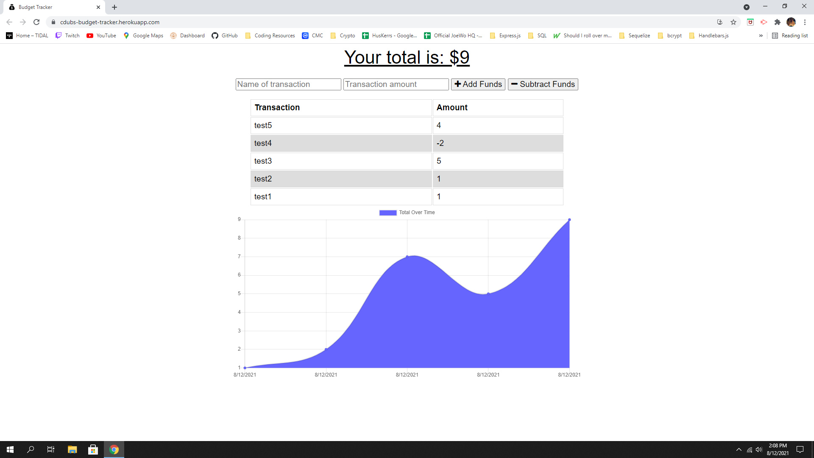

  <h1 align="center">C-Dubs Budget Tracker</h1>
  
 
## Description
A simple budget tracker you can access from any device.
## Table of Contents
- [Description](#description)
- [Installation](#installation)
- [Usage](#usage)
- [License](#license)
- [Contributing](#contributing)
- [Demo](#demo)
- [Questions](#questions)
## Installation
💾 After downloading the code, run npm install from the CL and then npm start to run.
## Usage
💻 To keep a history of simple budgeting with chart.
## License
   This application is covered by the MIT license.
## Contributing
👪 Chris Winters
## Demo

✏️ You can check out a live version of this app [here](https://cdubs-budget-tracker.herokuapp.com/)

It should look like this:

## Questions
🙋‍♂️ Email or reach me on my GitHub  
 
:octocat: Find me on GitHub: [cwinters87](https://github.com/cwinters87) 
 
✉️ Email me with any questions: taylor314@gmail.com  
🌟This README was generated by Chris Winters using the [readme-generator](https://github.com/cwinters87/readme-generator)